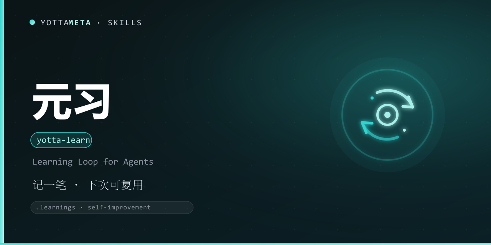

<p align="center">
  
</p>

<h1 align="center">yotta-learn · 元习</h1>

<p align="center">跨智能体的学习闭环技能：把错误、纠正与洞见沉淀为 <b>.learnings/</b> 条目，供后续会话与技能改进复用。适用于命令失败、用户纠正、发现更好做法、请求缺失能力、外部接口故障、知识过时等需要沉淀经验的场景。</p>
<p align="center">检测到命令失败 / 用户纠正 / 发现更好的做法 / 请求缺失能力 / 外部接口故障 / 知识过时 / 需要沉淀经验，或用户说 记一笔 / 学习 / 沉淀 / self-improvement / learnings 时自动激活——<b>不靠关键词碰运气，按是否需要沉淀经验判定</b>。</p>
<p align="center">Python 3.8+ 标准库实现，零依赖；Windows + Linux 通用；初始化绝不覆盖已有 .learnings/ 数据。</p>

<p align="center">
  <a href="LICENSE"></a>
  <a href="https://agentskills.io/"></a>
  <a href="https://www.npmjs.com/package/@yottameta/yotta-learn"></a>
  <a href="https://github.com/YottaMeta/yotta-learn"></a>
  <a href="https://github.com/YottaMeta/yotta-learn/commits/main"></a>
  <a href="https://github.com/YottaMeta/yotta-learn"></a>
</p>

## 这是什么

AI 智能体最常见的浪费，是同一个错误在不同会话里反复犯。元习把「这次学到的」变成「下次可复用的」：把错误、纠正与洞见沉淀为项目内的 .learnings/ 条目，供后续会话回看、统计与复用。

它不是某个平台的专属功能，而是一份与智能体无关的 CLI 工具包：装进任何支持 Agent Skills 的智能体即可按需调用，只写你指定的 .learnings/ 目录，也不需要在 package.json 写依赖。

## 核心价值

- **沉淀**：log 命令把条目写入 .learnings/（LEARNINGS / ERRORS / FEATURE_REQUESTS），自动编号 + 时间戳。
- **复用**：list / review / stats 回看与统计；promote 把重要条目提升到 AGENTS.md / CLAUDE.md。
- **改进**：extract 由高价值条目生成新技能骨架；Pattern-Key 追踪复发模式。
- **可联动**：log --remember 可选同步到 yotta-memory（元忆），未安装/失败自动降级，绝不阻断本地记录。
- **不覆盖**：初始化绝不改动已有 .learnings/ 数据，旧格式条目可读。

## 核心优势

| 优势 | 说明 |
|---|---|
| **跨智能体** | .learnings/ 是项目内文件，Claude Code / Codex / Cursor 等共享同一份 |
| **Pattern-Key 复发追踪** | 同一模式多次出现即提示，把偶发错误升级为系统性改进点 |
| **可联动可选** | 与元忆打通，但未安装/未初始化/失败自动降级 A/B/C，绝不阻断本地记录 |
| **幂等初始化** | init 可重复执行，不覆盖已有条目 |
| **自动去重** | promote / extract 自动去重，避免同一经验重复提升 |
| **零依赖** | Python 3.8+ 标准库，无 daemon / 无数据库；Windows + Linux 通用 |
| **生态分发** | GitHub + npm 双源同步发布；npx / install.sh / 手动复制三种安装方式 |

## 功能体系

| 命令 | 作用 |
|---|---|
| init | 初始化 .learnings/（幂等，不覆盖已有文件） |
| log | 记录一条学习/错误/功能请求（自动生成 ID 如 LRN-20260826-001） |
| list / review / stats | 回看、复审与统计条目 |
| promote | 把重要条目提升到 AGENTS.md / CLAUDE.md（自动去重） |
| extract | 由高价值条目生成新技能骨架（--dry-run 预览） |
| log --remember | 可选同步到元忆（yotta-memory），未安装自动降级 |

## 数据协议

- 目录：项目根 `.learnings/`（可用 `--dir` 指定）。
- 文件：LEARNINGS.md（LRN-）、ERRORS.md（ERR-）、FEATURE_REQUESTS.md（FEAT-）。
- ID：`LRN/ERR/FEAT-YYYYMMDD-XXX`（同一天自增）。
- 字段：Logged / Priority / Status / Area / Pattern-Key；正文分 Summary 与 Details。
- 兼容：已有用户数据保留，初始化绝不覆盖；旧格式条目可读。

## 使用示例

```bash
# 初始化 .learnings/（幂等，不覆盖已有文件）
python3 scripts/yotta_learn.py init

# 记录一条学习（自动生成 ID 如 LRN-20260826-001）
python3 scripts/yotta_learn.py log --type learning --category correction \
  --priority high --area git --pattern-key push-gate \
  --message "推送前必须先跑测试并核对输出"

# 记录一条错误（第二行起进入 Details）
python3 scripts/yotta_learn.py log --type error --priority critical \
  --message "第一行是摘要"$'\n'"第二行是详情"

# 列出 / 回看 / 统计
python3 scripts/yotta_learn.py list --status pending
python3 scripts/yotta_learn.py review
python3 scripts/yotta_learn.py stats

# 提升到 AGENTS.md / CLAUDE.md（自动去重）
python3 scripts/yotta_learn.py promote LRN-20260826-001

# 由条目生成技能骨架
python3 scripts/yotta_learn.py extract LRN-20260826-001 --slug my-skill --dry-run

# 可选：同步到元忆（yotta-memory），未安装自动降级
python3 scripts/yotta_learn.py log --message "..." --remember
```

**exit code 语义**：0 = 成功；1 = 未找到/无事可做；4 = 用法错误。

## 安装

三种方式任选其一，技能文件统一从 **npm** 获取（GitHub 无代理时较慢，npm 可配国内镜像加速）。

### 方式一：npm（推荐，一行安装）
```bash
# 国内加速（可选）：npm config set registry https://registry.npmmirror.com
npx -y @yottameta/yotta-learn -g
npx -y @yottameta/yotta-learn --agent codex   # 装到指定智能体（推荐）
npx -y @yottameta/yotta-learn --dir <你的技能目录>   # 任意智能体：指定目录安装
```
> 智能体不在预置列表里？用 `--dir` 指定它的 skills 目录，或手动复制（方式三）。`--list` 可查看各智能体对应的默认目录。想手动拿文件也可 `npm pack @yottameta/yotta-learn` 解包后按方式二/三安装。

### 方式二：install.sh 一键安装
```bash
bash install.sh -g    # 用户级；bash install.sh --list 查看全部目录
bash install.sh --agent codex   # 指定智能体（--list 可查看可用项）
bash install.sh       # 项目级：自动检测已存在的 .claude/.cursor/.codex 等 skills 目录
bash install.sh --dir /path/to/skills
```
> 覆盖 17 类智能体，含国内 Trae / Qwen / Comate / CodeBuddy / Kimi。Windows 用户：装有 Git Bash 即可用；否则用方式三手动复制。

### 方式三：手动复制
把整个 `yotta-learn` 文件夹复制到目标智能体的 skills 目录。常见位置（用户级；Windows 用 `%USERPROFILE%`，Linux/macOS 用 `~`）：

| 智能体 | 用户级目录 | 项目级目录 |
|---|---|---|
| Codex | `%USERPROFILE%\.codex\skills\yotta-learn\` | `.codex\skills\` |
| Claude Code | `%USERPROFILE%\.claude\skills\yotta-learn\` | `.claude\skills\` |
| Cursor | `%USERPROFILE%\.cursor\skills\yotta-learn\` | `.cursor\skills\` |
| Windsurf | `%USERPROFILE%\.codeium\windsurf\skills\yotta-learn\` | `.windsurf\skills\` |
| opencode | `%USERPROFILE%\.config\opencode\skills\yotta-learn\` | `.opencode\skills\` |
| Gemini | `%USERPROFILE%\.gemini\skills\yotta-learn\` | `.gemini\skills\` |
| Goose | `%USERPROFILE%\.config\goose\skills\yotta-learn\` | `.goose\skills\` |
| Amp | `%USERPROFILE%\.config\agents\skills\yotta-learn\` | `.agents\skills\` |
| Kiro | `%USERPROFILE%\.kiro\skills\yotta-learn\` | `.kiro\skills\` |
| WorkBuddy | `%USERPROFILE%\.workbuddy\skills\yotta-learn\` | `.workbuddy\skills\` |
| Trae Code CLI | `%USERPROFILE%\.traecli\skills\yotta-learn\` | `.traecli\skills\` |
| Trae IDE（国内） | `%USERPROFILE%\.trae-cn\skills\yotta-learn\` | `.trae\skills\` |
| Qwen Code | `%USERPROFILE%\.qwen\skills\yotta-learn\` | `.qwen\skills\` |
| Comate | `%USERPROFILE%\.comate\skills\yotta-learn\` | `.comate\skills\` |
| CodeBuddy | `%USERPROFILE%\.codebuddy\skills\yotta-learn\` | `.codebuddy\skills\` |
| Kimi | `%USERPROFILE%\.kimi\skills\yotta-learn\` | `.kimi\skills\` |
| 通用 AGENTS.md | `%USERPROFILE%\.agents\skills\yotta-learn\` | `.agents\skills\` |

> Codex 默认目录若设置了环境变量 `CODEX_HOME`，以该变量为准；opencode 若设置 `XDG_CONFIG_HOME` 同理。`.agents\skills` 并非通用目录，仅 OpenCode / Cursor / Cline / Amp / Kimi / Gemini CLI / GitHub Copilot 等会读取，**Claude Code 与 Codex 默认不读**。不确定时用 `--dir` 指定，或让该智能体自行安装。

## 升级 / 卸载

- **升级**：重新安装最新版覆盖即可——`npx -y @yottameta/yotta-learn -g` 或重跑 `bash install.sh -g`。技能目录内的旧文件会被覆盖；不影响项目中已有的其他文件。
- **卸载**：删除目标智能体 skills 目录下的 `yotta-learn` 文件夹（各智能体目录见上表）即可。卸载后本技能不再生效。

## 常见问题

- **会不会覆盖我已有的记录？** 不会。init 是幂等的，绝不改动已有的 .learnings/ 数据；旧格式条目也能读。
- **元忆没装，还能用吗？** 能。log --remember 是可选增强；未安装 / 未初始化 / 失败时自动降级（A/B/C），只在本地 .learnings/ 记录，绝不阻断。
- **会记录敏感信息吗？** 默认不记录私密信息（令牌、密钥、环境变量值、完整源码）；确有需要时建议用摘要或脱敏片段。
- **适合哪些团队？** 任何想避免「同一个错误反复犯」的智能体工作流，尤其是多智能体 / 多会话 / 多人协作场景。

## 相关技能

同属 YottaMeta 技能矩阵（学习与工程家族）：[yotta-memory](https://github.com/YottaMeta/yotta-memory)（元忆，跨会话长期记忆）与元习互补——一个管「项目内 .learnings/ 学习闭环」，一个管「跨会话长期记忆」；[anti-shallow](https://github.com/YottaMeta/anti-shallow)（防敷衍）与 [workflow-standard](https://github.com/YottaMeta/workflow-standard)（工作流标准）从执行纪律端配合，避免「会沉淀却不严谨」。

## 开发与校验

本项目内运行：`python tools/validate-skill.py yotta-learn`。

## 许可证

MIT © YottaMeta —— 详见 [LICENSE](./LICENSE)。品牌声明见 [NOTICE](./NOTICE)。上游来源致谢：协议与设计参考开源社区 self-improving-agent 类技能思路，实现为 YottaMeta 自有。
