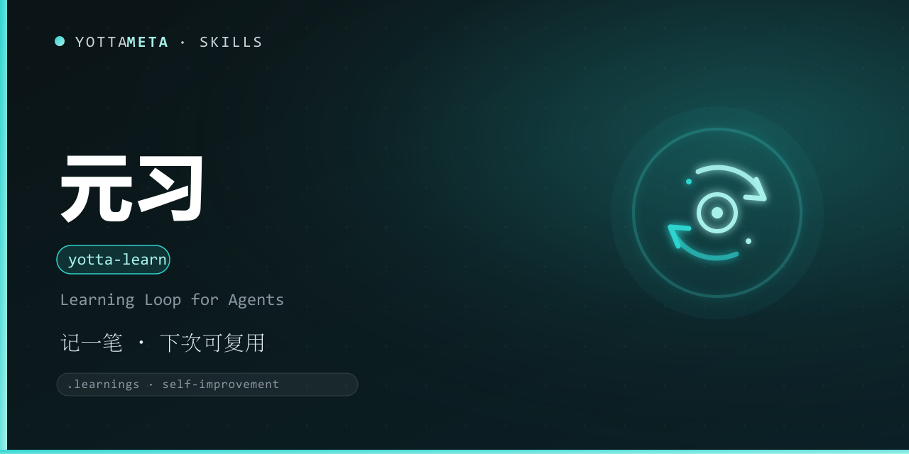

<p align="center"><b>Language</b>: English · <a href="./README.zh-CN.md">中文</a></p>

<p align="center">
  
</p>

<h1 align="center">yotta-learn · 元习</h1>

<p align="center">YottaMeta's cross-agent <b>learning-loop + knowledge base</b> skill: turns mistakes, corrections and insights into reusable <b>.learnings/</b> entries, and keeps verified knowledge in a categorized, indexed, keyword-searchable <b>knowledge base</b>. Suited for command failures, user corrections, discovering a better practice, requesting a missing capability, external-interface failures, stale knowledge, and capturing or querying reusable knowledge.</p>
<p align="center">Activates on command failure / user correction / a better approach / a missing capability / an external-interface failure / stale knowledge / a need to capture or query knowledge, or when the user says 记一笔 / learn / 沉淀 / 知识库 / kb / self-improvement / learnings — judged by whether experience should be captured, not by keyword luck.</p>
<p align="center">Python 3.8+ standard library, zero dependencies; Windows + Linux; init never overwrites existing .learnings/ data.</p>

<p align="center">
  <a href="LICENSE"></a>
  <a href="https://agentskills.io/"></a>
  <a href="https://www.npmjs.com/package/@yottameta/yotta-learn"></a>
  <a href="https://github.com/YottaMeta/yotta-learn"></a>
  <a href="https://github.com/YottaMeta/yotta-learn/commits/main"></a>
  <a href="https://github.com/YottaMeta/yotta-learn"></a>
</p>

## What it is

The most common waste for an AI agent is repeating the same mistake across sessions. Yuanxi turns "what I learned this time" into "reusable next time": it captures mistakes, corrections and insights as project-local .learnings/ entries for later sessions to review, aggregate and reuse — and keeps verified, reusable knowledge in a categorized knowledge base with indexed keyword search.

It is not tied to one platform — it is an agent-agnostic CLI toolkit: install it into any agent that supports Agent Skills, and it only writes to the .learnings/ directory you specify. No dependency is added to package.json.

## Core value

- **Capture** — the log command writes entries into .learnings/ (LEARNINGS / ERRORS / FEATURE_REQUESTS), auto-numbered and timestamped.
- **Close the loop** — update / resolve change entry status and resolution notes; list / review / stats review and aggregate; promote lifts important entries into AGENTS.md / CLAUDE.md.
- **Improve** — extract builds a new skill skeleton from high-value entries; Pattern-Key tracks recurring patterns.
- **Knowledge base** — the kb command group stores verified knowledge as categorized entries with sharded indexing and keyword search; writes default to draft, review promotes to verified, queries return verified by default.
- **Optional integration** — log --remember optionally syncs to yotta-memory; degrades gracefully when not installed / failed, and never blocks local capture.
- **No overwrite** — init never touches existing .learnings/ data; old-format entries remain readable.

## Advantages

| Advantage | Description |
|---|---|
| **Cross-agent** | .learnings/ is a project-local file; Claude Code / Codex / Cursor etc. share the same copy |
| **Pattern-Key recurrence** | Repeating patterns get flagged, upgrading occasional errors into systemic improvements |
| **Optional integration** | Connects to 元忆 but degrades A/B/C when not installed / uninitialized / failed, never blocks local capture |
| **Idempotent init** | init can be re-run without overwriting existing entries |
| **Auto-dedup** | promote / extract deduplicate automatically |
| **Searchable knowledge base** | Categories + sharded index + Chinese bigram keyword search; any agent reads and writes the same KB via CLI |
| **Reliability built in** | Atomic writes + cross-process lock + 7-day trash + snapshots + independent-directory backup + doctor checks |
| **Zero dependency** | Python 3.8+ standard library; no daemon / no database; Windows + Linux |
| **Ecosystem distribution** | GitHub + npm dual-source; four install methods (npx / git clone / Download ZIP / install.sh) |

## Commands

| Command | Purpose |
|---|---|
| init | Initialize .learnings/ (idempotent, never overwrites existing files) |
| log | Record a learning / error / feature request (auto ID like LRN-20260826-001) |
| update / resolve | Update entry status / priority / resolution note (resolve marks it resolved) |
| list / review / stats | Review and aggregate entries |
| promote | Lift important entries into AGENTS.md / CLAUDE.md (auto-dedup) |
| extract | Build a skill skeleton from high-value entries (--dry-run preview) |
| kb | Knowledge base: init / config / category / add / review / query / index / stats / doctor / backup and more |
| log --remember | Optional sync to yotta-memory; degrades when not installed |

## Data protocol

- Directory: project root .learnings/ (override with --dir).
- Files: LEARNINGS.md (LRN-), ERRORS.md (ERR-), FEATURE_REQUESTS.md (FEAT-).
- ID: `LRN/ERR/FEAT-YYYYMMDD-XXX` (auto-increment per day).
- Fields: Logged / Priority / Status / Area / Pattern-Key; body split into Summary and Details.
- Compatibility: existing user data is preserved; init never overwrites; old-format entries readable.
- Knowledge base: defaults to `~/.yottalearn/knowledge` (config `~/.yottalearn/config.json`; any location via `kb config set --dir <path>`, `--move` migrates the old library); entries are Markdown with controlled frontmatter, IDs `KB-YYYYMMDD-XXX`, status draft / verified / deprecated.
- AI interface: MCP stdio (`scripts/yotta_learn_mcp.py`; 12 read/write/ops tools, write tools fail-closed and share the CLI kernel); local-only web console `yotta-learn view` (127.0.0.1 only, seven views).
- Promotion: `kb add --from-learning <LRN-ID>` turns a .learnings entry into a KB draft (portable source reference, still gated by review).

## Usage

```bash
# Initialize .learnings/ (idempotent, never overwrites existing files)
python3 scripts/yotta_learn.py init

# Record a learning (auto ID like LRN-20260826-001)
python3 scripts/yotta_learn.py log --type learning --category correction \
  --priority high --area git --pattern-key push-gate \
  --message "Run the tests and verify output before pushing"

# Record an error / feature request
python3 scripts/yotta_learn.py log --type error --category error --priority medium \
  --area build --pattern-key pyc --message "py_compile created __pycache__ that leaked into npm pack"

# Review and aggregate
python3 scripts/yotta_learn.py list
python3 scripts/yotta_learn.py stats

# Update status / resolution note (resolve = update --status resolved)
python3 scripts/yotta_learn.py update LRN-20260826-001 --status in_progress --note "in progress"
python3 scripts/yotta_learn.py resolve LRN-20260826-001 --note "fixed and regression-tested"

# Lift an important entry into AGENTS.md / CLAUDE.md (auto-dedup)
python3 scripts/yotta_learn.py promote ERR-20260827-003

# Build a skill skeleton from a high-value entry (preview only)
python3 scripts/yotta_learn.py extract LRN-20260826-001 --slug my-skill --dry-run

# Optional: sync to yotta-memory; degrades when not installed
python3 scripts/yotta_learn.py log --message "..." --remember

# Knowledge base: init -> category -> draft -> review -> query
python3 scripts/yotta_learn.py kb init
python3 scripts/yotta_learn.py kb category create agent-skills \
  --name "Agent & skill development" --description "Knowledge and methods for skill development and orchestration"
python3 scripts/yotta_learn.py kb add --category agent-skills \
  --title "SQLite FTS5 Chinese search pitfalls" \
  --message "Default tokenizer is weak for Chinese; use bigrams or an external tokenizer." \
  --tags "sqlite,search" --source "experiment"
python3 scripts/yotta_learn.py kb review KB-20261005-001 --pass --evidence "verified locally"
python3 scripts/yotta_learn.py kb query 中文检索
```

**Exit-code semantics**: 0 = success; 1 = not found / nothing to do; 4 = usage or validation error; 5 = gate blocked (sensitive / duplicate); 6 = integrity (refused overwrite / corrupted data / lock timeout).
**Category values**: `correction` / `insight` / `knowledge_gap` / `best_practice` / `error` / `other`; use `other` when unsure.

## Installation

Pick any of the four methods below; the order is the recommended priority. Skill files always come from **npm** (GitHub can be slow without a proxy; npm supports mirrors).

### Method 1: npm one-liner (recommended)

```text
# Optional China mirror: npm config set registry https://registry.npmmirror.com
npx -y @yottameta/yotta-learn --agent <agent-name>      # install to the agent's default user-level skills dir
npx -y @yottameta/yotta-learn --dir <your-skills-dir>   # point to the skills dir itself (e.g. ~/.codex/skills)
```

- `--agent <name>` installs to that agent's default user-level directory; `--list` shows each agent's default directory.
- `--dir <path>` installs to the given directory; for agents not in the preset list, point `--dir` at their skills directory.
- If the mirror has not synced the new package (404): add `--registry=https://registry.npmjs.org/` (a proxy may be needed in China), or wait for the mirror cache.

### Method 2: git clone (developers / git available)

```text
git clone https://github.com/YottaMeta/yotta-learn.git <your-skills-dir>/yotta-learn
```

### Method 3: GitHub Download ZIP (manual / no git)

On the GitHub repository `YottaMeta/yotta-learn`, click **Code → Download ZIP**, unzip it and put the `yotta-learn` folder into the agent's skills directory.

### Method 4: install.sh (multi-agent one-liner script)

```text
bash install.sh --agent <name>   # install to the agent's default user-level directory
bash install.sh --dir <path>     # install to the given directory
bash install.sh --list           # list agents -> default directories
```

> Method 1 uses the npm registry (npmmirror / npmjs) and does not depend on GitHub; Methods 2/3 use GitHub and may fail without a proxy in China.
## Upgrade / uninstall

- **Upgrade**: reinstall the latest version to overwrite — rerun the install command you used (e.g. `npx -y @yottameta/yotta-learn --agent <name>` or `bash install.sh --agent <name>`). Old files in the skill directory are replaced; other project files are untouched.
- **Uninstall**: delete the `yotta-learn` folder in the target agent's skills directory (see the table above).

## FAQ

- **Will it overwrite my existing entries?** No. init is idempotent and never touches existing .learnings/ data; old-format entries remain readable.
- **Can I use it without 元忆?** Yes. log --remember is optional; it degrades A/B/C when not installed / uninitialized / failed, recording only locally in .learnings/ and never blocking you.
- **Does it record sensitive info?** By default no (tokens, keys, env-var values, full source). If truly needed, use a summary or a redacted snippet.
- **Who is it for?** Any agent workflow that wants to avoid repeating the same mistake — especially multi-agent / multi-session / multi-person collaboration.

## Related skills

Same YottaMeta skill matrix (learning & engineering family): [yotta-memory](https://github.com/YottaMeta/yotta-memory) (元忆, cross-session long-term memory) complements 元习 — one handles "project-local .learnings/ loop", the other "cross-session long-term memory"; [anti-shallow](https://github.com/YottaMeta/anti-shallow) (anti-shallow) and [workflow-standard](https://github.com/YottaMeta/workflow-standard) (workflow standard) reinforce it from the execution-discipline side, so you don't "capture but stay sloppy".

## Development & validation

Run in this repo: `python tools/validate-skill.py yotta-learn`.

## License

MIT © YottaMeta — see [LICENSE](./LICENSE). Brand statement in [NOTICE](./NOTICE). Upstream attribution: protocol & design reference the open-source self-improving-agent family; implementation is YottaMeta's own.
